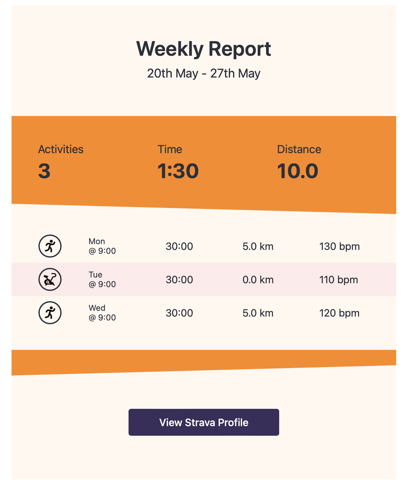
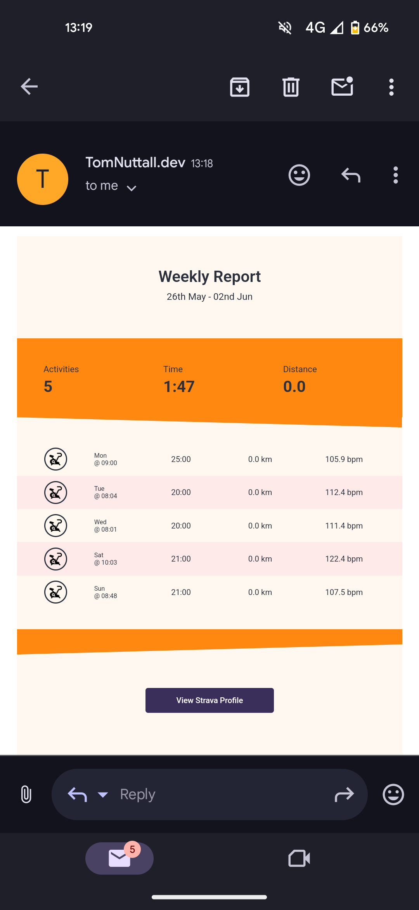

# Strava API Summary

Demo Project: Run a weekly Lambda to call the Strava API and send an activity summary email.

<div>
  
  

</div>

## Project Overview

### Strava API

> :book: [Integrating with the Strava API](https://levelup.gitconnected.com/integrating-with-the-strava-api-40244b17df2c)

### 🛠️ App

> :book: [App Readme](app/README.md)

- AWS Lambda querys stravas api and sends an email summary
- [Email Design](https://codepen.io/krychek50/pen/rNgWMby)

### :bricks: Infastructure

> :book: [Infastructure Readme](infastructure/README.md)

- CloudFormation templates used to deploy AWS infastructure
- GitHub actions deploy lambda and image assets.

## Run

Generate app/example_email.html

```
cd app/src
python example_email.py
```
