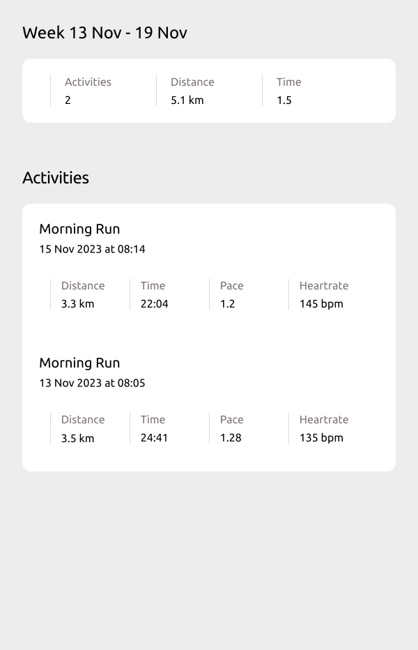

# Strava API Demo Project

Demo Project: Runs a weekly Lambda to call the Strava API and send an activity summary email.

## Strava API

> :book: [Integrating with the Strava API](https://levelup.gitconnected.com/integrating-with-the-strava-api-40244b17df2c)

## 🛠️ App

> :book: [App Readme](app/README.md)
> :book: [Tests Readme](tests/README.md)

- AWS Lambda querys stravas api and sends an email summary

## :bricks: Infastructure

> :book: [Infastructure Readme](infastructure/README.md)

- CloudFormation templates used to deploy AWS infastructure
- GitHub actions deploy lambda.

## Design

