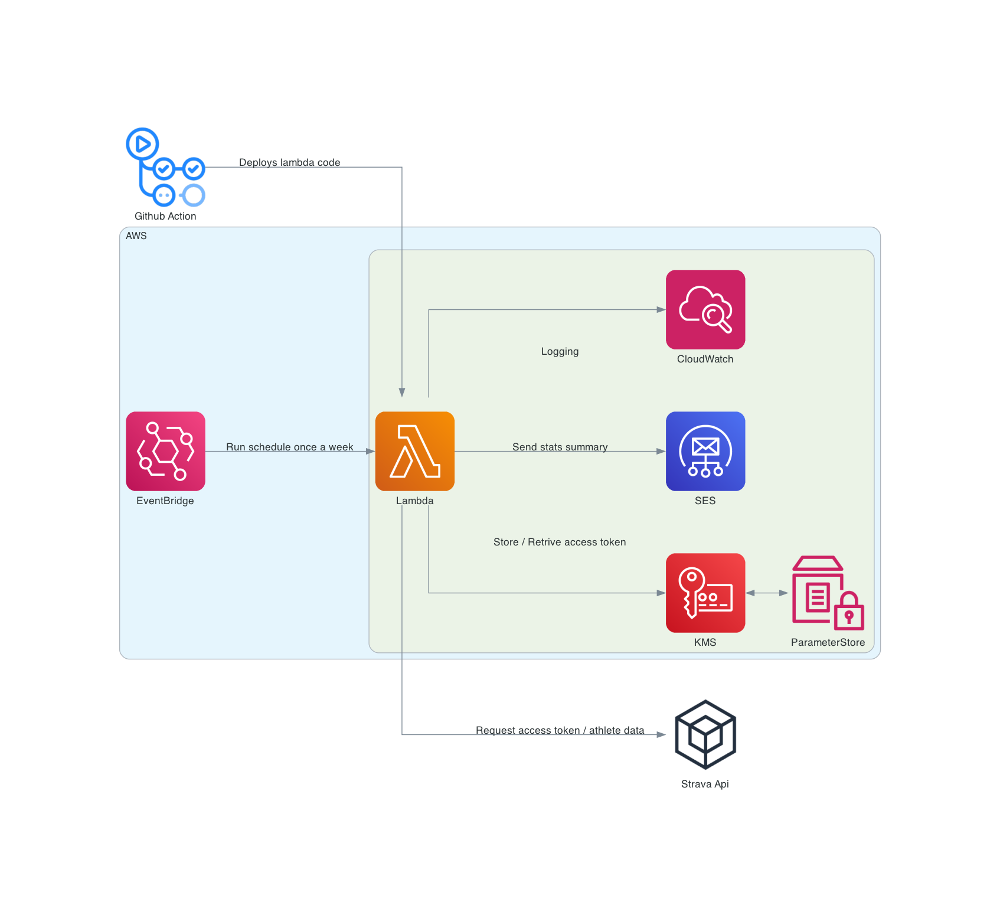

# Infastructure

## Overview

- CloudFormation templates used to deploy infastructure on AWS.
- GitHub action runs on push to main branch.
  - deploy-lambda runs on change in app/src folder.
    - Runs lambda unit tests, builds lambda package then deploys.
  - deploy-assets runs on change in assets folder.
    - Syncs image assets folder with s3 bucket.

## Architecture Diagram



### Parameter Store

- Create two secure string parameters in Paramater Store
- One for app details, these should be set from following the [Strava Api](../README.md#strava-api) steps

```json
{
  "client_id": "",
  "client_secret": "",
  "code": "",
  "athelete": {
    "id": ""
  }
}
```

- One for token details, these will be filled in when the lambda first runs.

```json
{
  "expires_at": "",
  "access_token": "",
  "refresh_token": ""
}
```

### SES verified email/domain

Add a verified domain and a verified email in SES

### Environment variables for lambda

Add `TARGET_EMAIL` and `SEND_EMAIL` environment variables for the lamba and use the verified emails.
Add `ATHLETE_ID` environment variables for the lamba and use strava athlete id.
Add `ASSET_URL` for icon image cdn path
